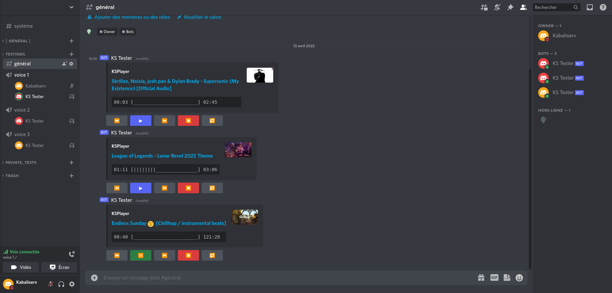

# Discord Bot Multi Player

## Features

### Highlights

- Simple & easy to use 😁
- Support YouTube, SoundCloud and other 👌
- Play in several channels at the same time on the same server 🎵
- Slash Commands support 🤖
- Embed view to control the player with buttons 🎛️

### Commands

| Name          |                         Description                         | Options |
|:--------------|:-----------------------------------------------------------:|--------:|
| **/play**     |               Play from url or resume player                |  \<url> |
| **/pause**    |                   Pause the current song                    |         |
| **/next**     |                      Go to next track                       |         |
| **/previous** |                   Play the previous track                   |         |
| **/stop**     |                       Stop the player                       |         |
| **/add**      |             Add track in current playing queue              |     url |
| **/repeat**   | Change repeat mode **[one, all, none]** (default: **none**) |    mode |
